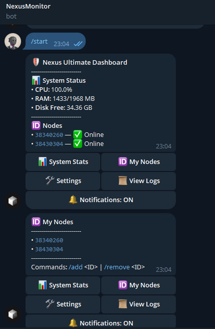
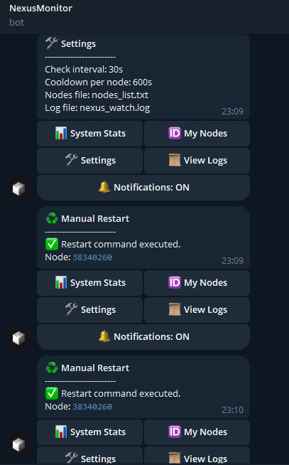
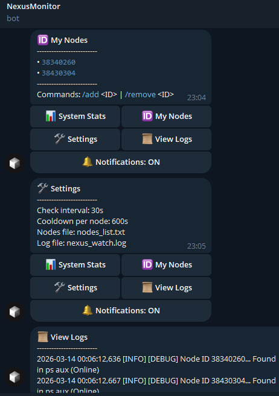

# Nexus Sentinel

A self-healing Telegram bot that monitors your [Nexus Network](https://nexus.xyz) nodes, alerts you when they go down, and automatically restarts them via `screen`.
## 📸 Dashboard Preview
<p align="center">
  
  
  
</p>
## Features

- **Per-node monitoring** — checks each node independently via `ps aux`
- **Auto-restart** — relaunches dead nodes using `screen` sessions
- **Smart cooldown** — prevents restart spam with a per-node cooldown timer
- **Telegram dashboard** — inline keyboard with system stats, node list, logs, and settings
- **Notifications toggle** — enable/disable alerts without stopping the bot
- **Manual restart** — trigger a restart for any node directly from Telegram

## Requirements

- Python 3.10+
- `screen` (`apt install screen` / `pacman -S screen` / `dnf install screen`)
- A Telegram bot token from [@BotFather](https://t.me/BotFather)
- Your Telegram chat ID (get it from [@userinfobot](https://t.me/userinfobot))

## Installation

```bash
git clone https://github.com/CryptoB1t/nexus-sentinel-dashboard
cd nexus-sentinel-dashboard
chmod +x deploy.sh
./deploy.sh
```

`deploy.sh` will:
1. Open `.env` in `nano` — fill in your bot token and chat ID, then save and exit
2. Create a Python virtual environment and install Python dependencies
3. Patch the systemd service file with your actual install path
4. Register and start the service

After deploying, check that everything is running:

```bash
sudo systemctl status nexus-sentinel
sudo journalctl -u nexus-sentinel -f
```

## Uninstall / Redeploy from scratch

```bash
sudo systemctl stop nexus-sentinel
sudo systemctl disable nexus-sentinel
sudo rm /etc/systemd/system/nexus-sentinel.service
sudo systemctl daemon-reload
rm -f .env
rm -rf .venv data/
```

Then run `./deploy.sh` again.

## Configuration

All configuration is done via `.env`. `deploy.sh` creates it from `.env.example` automatically.

| Variable | Required | Default | Description |
|---|---|---|---|
| `TELEGRAM_BOT_TOKEN` | ✅ | — | Bot token from @BotFather |
| `ADMIN_CHAT_ID` | ✅ | — | Your Telegram chat ID |
| `NEXUS_PATH` | | `/root/.nexus/bin/nexus-network` | Path to the nexus-network binary |
| `CHECK_INTERVAL_SECONDS` | | `30` | How often to poll node status (seconds) |
| `COOLDOWN_SECONDS` | | `600` | Cooldown between restarts per node (seconds) |
| `DATA_DIR` | | `data/` | Directory for nodes list, settings, and logs |

## Bot Commands

| Command | Description |
|---|---|
| `/start` | Open the main dashboard |
| `/status` | Show system stats and node status |
| `/add <ID>` | Add a node ID to the watchlist |
| `/remove <ID>` | Remove a node ID from the watchlist |

The inline keyboard also provides quick access to node logs, manual restarts, and notification toggles.

## Project Structure

```
nexus-sentinel/
├── monitor.py               # Main bot + monitoring logic
├── deploy.sh                # One-shot install script
├── requirements.txt         # Python dependencies
├── nexus-sentinel.service   # systemd service file
├── .env.example             # Environment variable template
├── .gitignore
└── data/                    # Created at runtime (gitignored)
    ├── nodes_list.txt        # Watched node IDs
    ├── settings.json         # Bot settings (notifications toggle)
    └── nexus_watch.log       # Bot log file
```
